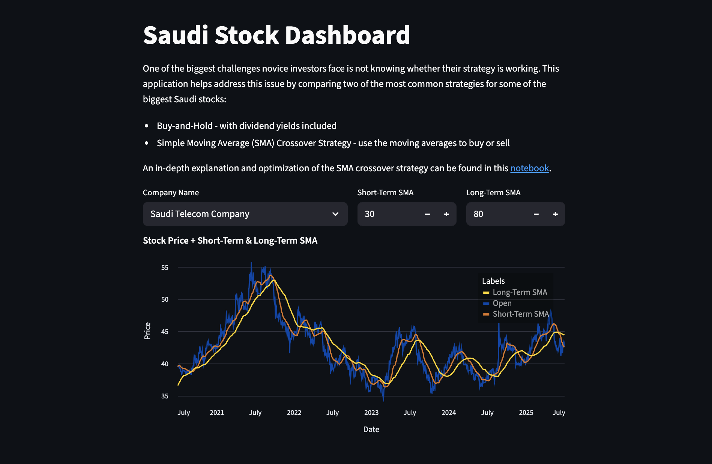

# Saudi Stock Dashboard  

An interactive dashboard analyzing **Aramco stock** using the **SMA (Simple Moving Average) crossover strategy** and comparing it with a **Buy‑and‑Hold strategy**.  

The project includes:  
- **Jupyter Notebook Analysis** – Evaluates SMA crossover performance, trend persistence, and historical returns for Aramco stock.  
- **Streamlit Dashboard** – Visualizes price trends, overlays moving averages, and compares Buy‑and‑Hold vs. SMA crossover returns with key metrics.  

## 🔗 Live Demo  

👉 **[Launch the Saudi Stock Dashboard](https://saudi-stock-dashboard.streamlit.app/)**  

## 📷 Screenshot  

## 📊 Features  

- Historical SMA crossover analysis for Aramco stock  
- Interactive date range selection  
- Comparison of **Buy‑and‑Hold vs. SMA crossover** returns  
- Key metrics including annualized returns, volatility, and drawdowns  
- Altair visualizations with SMA overlays  

## 📓 Notebook  

Check out the detailed analysis in the [Jupyter Notebook](https://github.com/mohammedalwosaibi/saudi-stock-dashboard/blob/main/notebooks/aramco_strategy_analysis.ipynb).  
